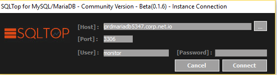

# SQLTop for MariaDB

## The Basics
SQLTop for MariaDB was inspired by the system monitoring tool top. Administrators routinely use top on Linux, FreeBSD, and Solaris. You are likely to notice features from each of them for Database System to review quickly Database Performance issues without installations, db repositories or high level privileges, most important totally portable, just copy and launch it.

SQLTop for MariaDB will connect to a MariaDB server and periodically run the SHOW PROCESSLIST and SHOW STATUS commands and attempt to summarize the information from them in a useful format.

## Download
You can download the binaries directly from files section or from www.sqltop.com/sqltop-for-mariadb/

## Screenshoots

## Contributing

Help is always welcome in improving this software. Feel free to contact the author (see AUTHOR below) with bug reports, fixes, suggestions, and comments.

## Autor

SQLTop for MariaDB was developed and is maintained by SQLTop Community Team (community@sqltop.com)

